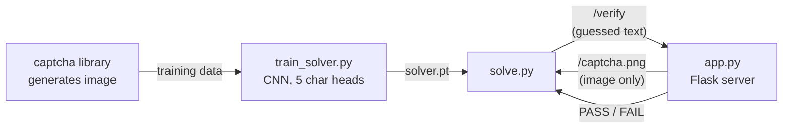
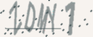
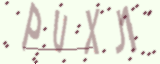
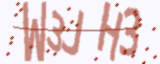
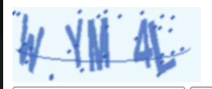
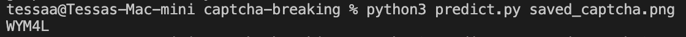
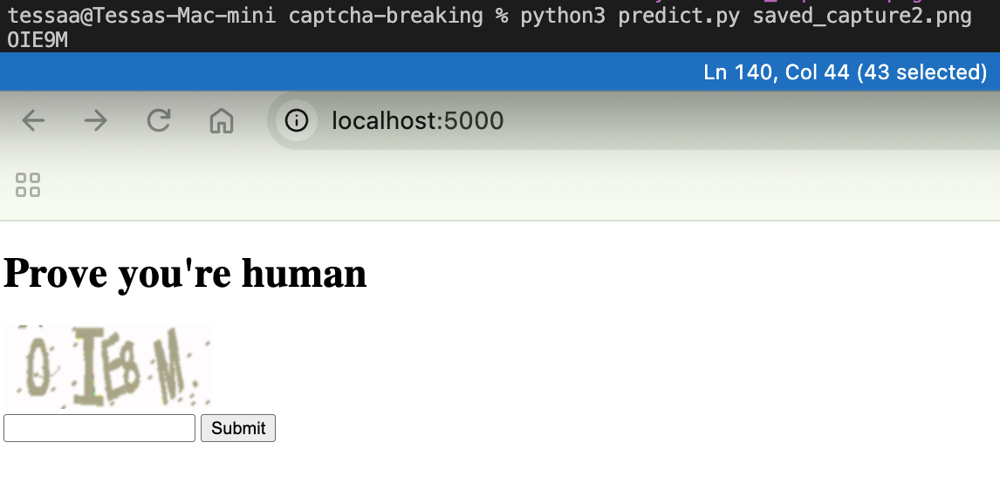

# CAPTCHA Breaking

A self-contained demo of the offensive side of CAPTCHA design: we spin up a real
distorted-text CAPTCHA server locally (`app.py`) to generate live challenges, then use a
CNN solver — fine-tuned from a pretrained ResNet18 backbone (`train_solver.py` /
`solve.py`) — to break them.

The server never exposes the answer to the client — only an opaque session token and the
rendered image round-trip over HTTP. The only way to solve a challenge is to read the
image, the same constraint a real attacker faces.



## Why this matters

CAPTCHA ("Completely Automated Public Turing test to tell Computers and Humans Apart")
exists to gate an action behind a task assumed to be easy for humans and hard for
automated scripts. Distorted-text CAPTCHAs were a strong version of that assumption for
years — but a CNN can now learn the noise/distortion patterns from a modest labeled
dataset and read them about as reliably as a human, closing that gap. This project
demonstrates that gap closing end to end: a real CAPTCHA server, and a trained model
solving it live.

## Results

Everything below was trained and attacked locally on a single machine — no cloud
compute, no paid API. Getting to a real break took several failed/partial attempts:

| Attempt | Approach | Local training time | Per-character acc | Full-string acc (live) |
|---|---|---|---|---|
| 1 | From-scratch CNN, 8k fixed images, high LR | ~4 min | 52% | 3.8% |
| 2 | From-scratch CNN, deeper + batch norm, fixed LR | ~10 min | 85% | 52% |
| 3 | From-scratch CNN, streamed data + LR decay | ~47 min | 89% | 62% |
| 4 | **ResNet18 transfer learning (current)** | **~33 min** | **99.1%** | **92–96%** |

Attempts 1-3 were the from-scratch CNN, just with more training tricks thrown at it each
round (more data, better architecture, adaptive learning rate) — and it kept plateauing in
the 50-60% range no matter how long we trained it. The breakthrough wasn't more training,
it was starting from a different foundation entirely.

The current solver (`model.py`) fine-tunes a pretrained, ImageNet-trained ResNet18 —
its first conv layer is adapted from 3-channel color to our 1-channel grayscale input by
averaging its pretrained RGB filter weights, and its classifier head is replaced with 5
parallel heads, one per character position. Trained with streamed, on-the-fly generated
CAPTCHAs and learning-rate decay on plateau (`train_solver.py`).

The jump from ~60% to 92-95% is the actual payoff of transfer learning: a from-scratch
CNN has to learn what a letter even looks like using only our own generated images, while
a pretrained backbone already carries broad visual knowledge from millions of real images
(ImageNet) and only needs to adapt that knowledge to this specific noise/distortion style
— which is a much smaller ask, and it shows in both the accuracy and how few epochs it
took to get there.

A contour-based segmentation attack (crop each letter, classify individually — the
classic approach used by [Sam Bowne's CAPTCHA-breaking tutorial][samsclass], which
reports 93% train / 86% test accuracy) was also tried and rejected here: it only isolated
exactly 5 clean letters on 4.5% of images, because the `captcha` library's noise curves are
specifically drawn to cross letter boundaries and defeat that trick (see `segment.py`).
That tutorial's CAPTCHA generator produces cleanly separated letters, which is exactly what
makes segmentation work there but not here — the whole-image CNN sidesteps the problem
entirely by reading the full picture at once instead of relying on separable letters.

[samsclass]: https://samsclass.info/129S/proj/ML102.htm

### Example predictions

Fresh, never-trained-on CAPTCHAs run through the solver (regenerate with
`python make_examples.py`):

| Image | True | Guessed | Result |
|---|---|---|---|
|  | `BAQ8S` | `BAQ8S` | ✅ |
|  | `UCAOC` | `UCAOC` | ✅ |
|  | `VD6QP` | `VD6QP` | ✅ |
|  | `ZDMY1` | `ZDMY1` | ✅ |
|  | `PUXJ1` | `PUXJ1` | ✅ |
|  | `QWBA8` | `QWBA8` | ✅ |
|  | `ZP1YX` | `ZP1YX` | ✅ |
|  | `W3JH3` | `W3JH3` | ✅ |

This particular batch came back clean, but the model isn't perfect — the live attack run
below still misses about 1 in 12 attempts, usually on visually ambiguous glyphs (e.g.
`0`/`O`, `1`/`I`).

## Setup

```bash
pip install -r requirements.txt
```

## 1. Generate a validation set

Renders labeled CAPTCHA images offline, held out and never trained on, used to score the
model during training.

```bash
python generate_dataset.py --train 0 --val 2000
```

## 2. Train the solver

Fine-tunes the pretrained ResNet18 backbone on a fresh, unique batch of generated
CAPTCHAs every epoch (no fixed training file set, so it never repeats an image), with the
learning rate halved whenever validation accuracy plateaus. The first run downloads
ImageNet-pretrained ResNet18 weights (~45MB) automatically via torchvision.

```bash
python train_solver.py --epochs 25 --samples-per-epoch 15000
```

## 3. Run the real CAPTCHA server

```bash
python app.py
```

Visit http://127.0.0.1:5000 to try it yourself.

## 4. Attack it

First, solve the exact CAPTCHA you're looking at in the browser: save/screenshot that
image to a file and run:

```bash
python predict.py path/to/saved_captcha.png
```

It prints the model's guess so you can type it into the form yourself.

### Real-world verification

Manually tested against the browser, not just the automated scripts — saved a CAPTCHA
straight from the running page and ran `predict.py` on it directly:





Ran a second time against a fresh CAPTCHA, this time with the browser tab visible
alongside the terminal for a direct side-by-side check:




Both guesses were correct on the first try, confirming the model works against the actual
running server, not just the offline validation set.

### Automated batch attack

With the server running in another terminal, attack it repeatedly instead of one image at
a time:

```bash
python solve.py --attempts 50
```

Reports the model's solve rate against live, never-before-seen challenges. Real output
from a run against the local server:

<details>
<summary>Full 50-attempt run (click to expand) — 48/50 (96.0%)</summary>

```
attempt 1: guessed A8QVN -> PASS
attempt 2: guessed AM3VT -> PASS
attempt 3: guessed Y5VPC -> PASS
attempt 4: guessed MAGU3 -> PASS
attempt 5: guessed 3F1K3 -> PASS
attempt 6: guessed 8K9L7 -> PASS
attempt 7: guessed FE0FJ -> PASS
attempt 8: guessed YL6JW -> PASS
attempt 9: guessed 8R964 -> PASS
attempt 10: guessed DGC5D -> PASS
attempt 11: guessed 0YFYD -> PASS
attempt 12: guessed ECNW8 -> PASS
attempt 13: guessed EJREO -> PASS
attempt 14: guessed YF79N -> PASS
attempt 15: guessed U8MXN -> PASS
attempt 16: guessed 9KF83 -> PASS
attempt 17: guessed PT67B -> PASS
attempt 18: guessed JSB3L -> PASS
attempt 19: guessed FN0SV -> PASS
attempt 20: guessed INR3V -> PASS
attempt 21: guessed YESY3 -> PASS
attempt 22: guessed G9WLA -> PASS
attempt 23: guessed PI3NH -> PASS
attempt 24: guessed ZSQZF -> PASS
attempt 25: guessed E04TW -> FAIL
attempt 26: guessed 8MZH2 -> PASS
attempt 27: guessed JGY4J -> PASS
attempt 28: guessed 4SAY1 -> PASS
attempt 29: guessed 9D06J -> PASS
attempt 30: guessed 5MJXU -> PASS
attempt 31: guessed ZKG9R -> PASS
attempt 32: guessed D16ET -> PASS
attempt 33: guessed 8RH1O -> PASS
attempt 34: guessed VNFDO -> PASS
attempt 35: guessed ZYISI -> PASS
attempt 36: guessed 9VOYV -> PASS
attempt 37: guessed L8JBW -> PASS
attempt 38: guessed P8XKT -> PASS
attempt 39: guessed BUWZQ -> PASS
attempt 40: guessed WYHF3 -> PASS
attempt 41: guessed 2ZJJJ -> PASS
attempt 42: guessed 6YVHM -> PASS
attempt 43: guessed ISXU5 -> PASS
attempt 44: guessed B6HOC -> PASS
attempt 45: guessed SC71H -> PASS
attempt 46: guessed 0RYKD -> PASS
attempt 47: guessed 4NOGE -> FAIL
attempt 48: guessed W98K8 -> PASS
attempt 49: guessed 07Q4I -> PASS
attempt 50: guessed FV7II -> PASS

solved 48/50 (96.0%)
```

</details>

## Defensive countermeasures

A 92% live solve rate means this CAPTCHA is broken outright, not just weakened — a bot
succeeds on nearly every attempt, and even without transfer learning the 52-62% range from
earlier iterations was already enough to get through in a couple of retries. What this
project suggests for anyone actually defending a CAPTCHA:

- **Noise curves and distortion are not durable defenses against ML.** They defeated the
  classic segmentation attack (4.5% success) but did nothing against a whole-image CNN, and
  pretrained-backbone transfer learning erased almost all of the remaining gap. Visual
  distortion mainly raises the cost of building an attack once — after that, it's solved.
- **Rate limiting / retry throttling matters more than the CAPTCHA's raw difficulty.** Any
  solver above a few percent becomes a real threat if it can retry unlimited times with no
  backoff, lockout, or CAPTCHA rotation after failures — and 92% barely needs a retry at all.
- **Behavioral/interaction-based CAPTCHAs (reCAPTCHA v3, hCaptcha) sidestep this whole
  attack class** — they score mouse movement, timing, and device signals instead of asking
  the client to read anything, so there's no image for a CNN to attack in the first place.
- **Server-side anomaly detection** (request velocity, IP reputation, session patterns) is a
  second layer that doesn't depend on the CAPTCHA being unsolvable at all.

## Notes

- CAPTCHA text is 5 characters from `A-Z0-9`, rendered with `captcha`'s noise/distortion.
- The answer store is an in-memory dict — fine for this single-process local demo, not for
  production use.
- This is for local, self-hosted testing only. Don't point `solve.py` at a CAPTCHA you don't
  own or have permission to test.
