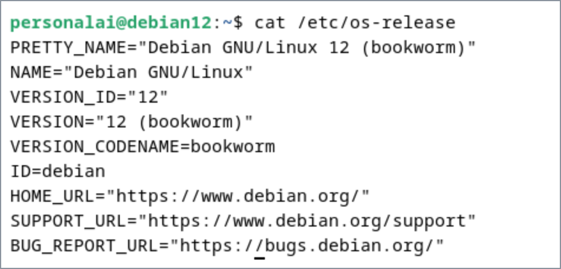
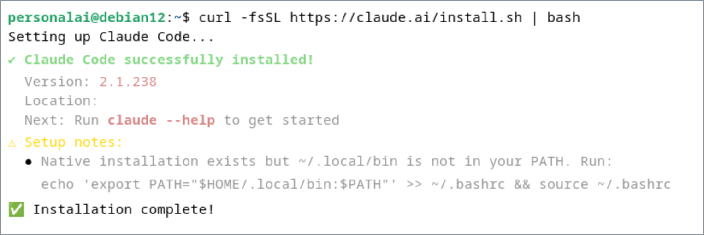
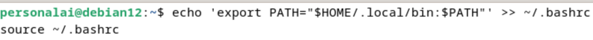
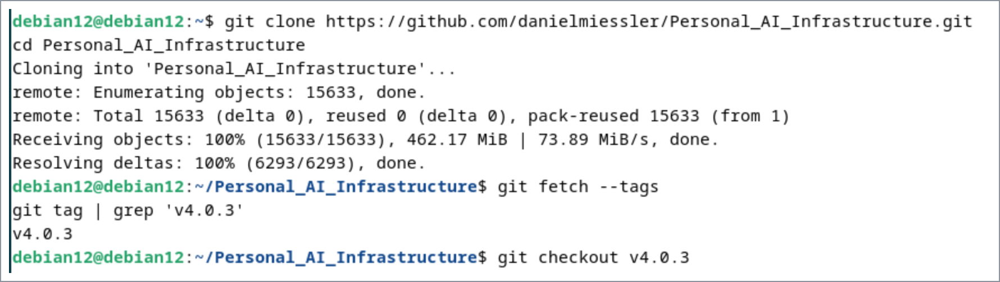
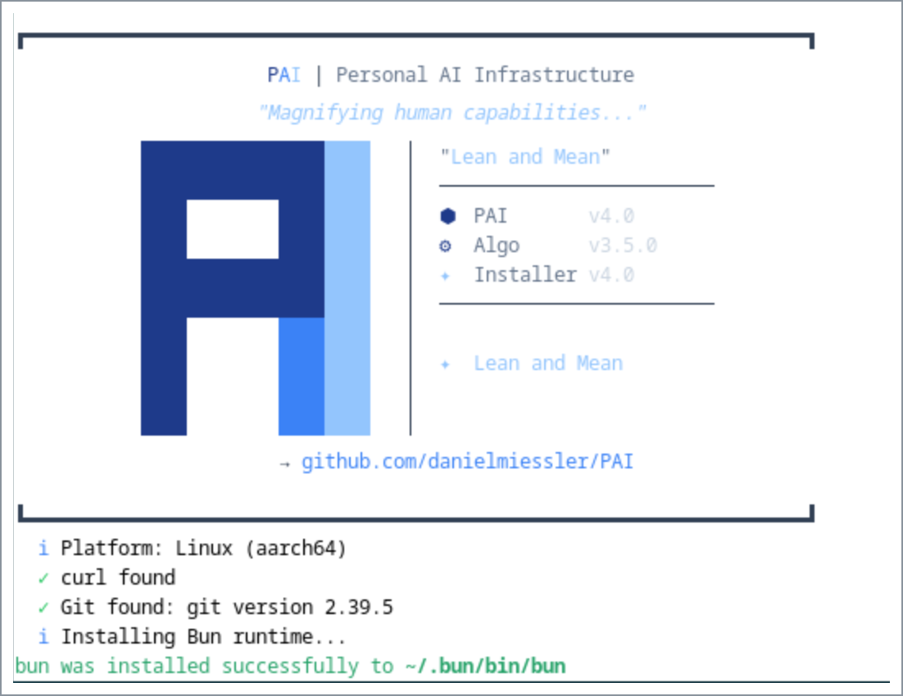
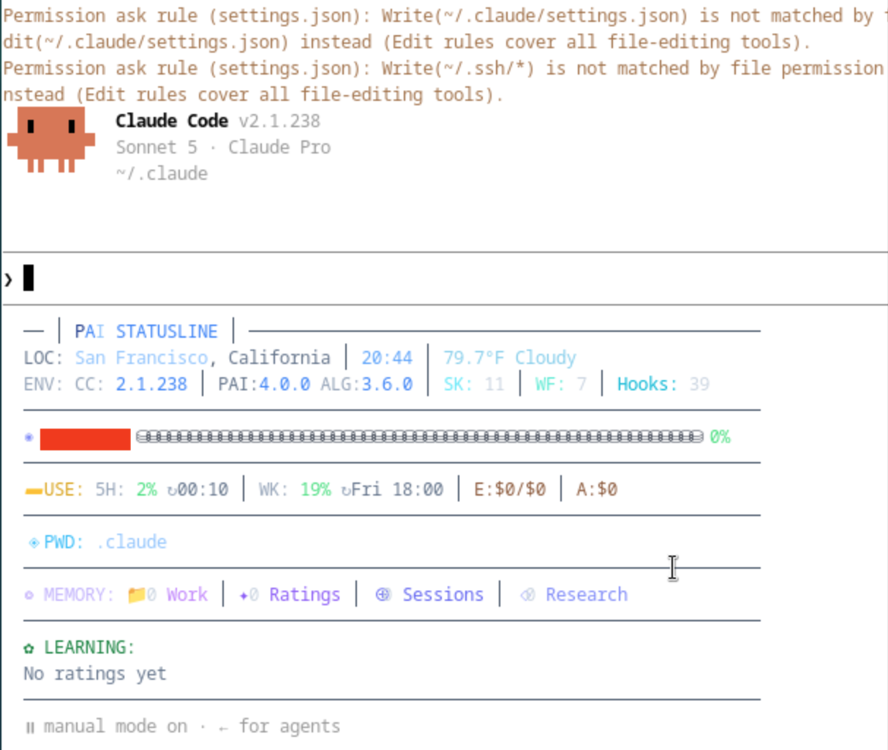
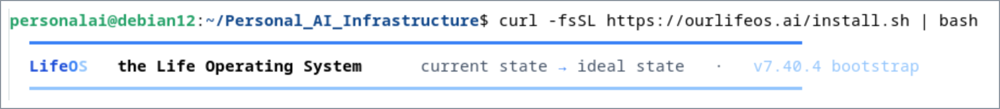
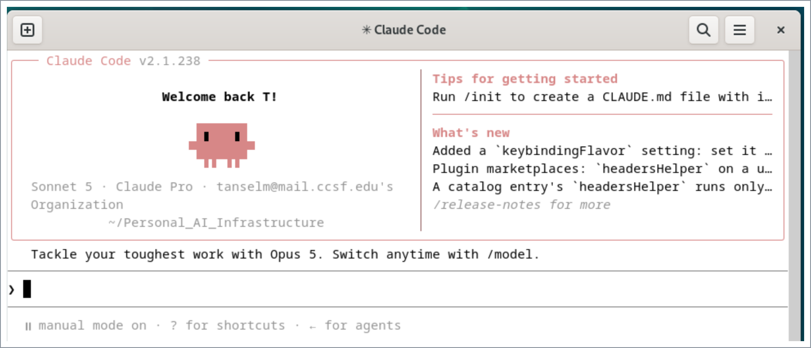

# Personal AI Infrastructure (PAI) and LifeOS on Debian

A practical walkthrough for running two generations of Daniel Miessler's Personal AI Infrastructure on top of [Claude Code](https://claude.ai/code) inside a Debian VM.

This walkthrough covers:

- PAI v4.0.3
- LifeOS v7.40.4
- Claude Code on Debian
- Bash `PATH` troubleshooting
- optional Linux user isolation
- basic VM resource and security considerations

## Environment



Both environments run inside a Debian VM rather than directly on the host machine. The VM provides its own filesystem, users, and software environment.

Access to host files, browser profiles, credentials, shared folders, clipboard data, or other host resources depends on what is explicitly exposed through the VM configuration.

- **VM:** Debian GNU/Linux 12 (bookworm)
- **Agent runtime:** Claude Code CLI
- **Earlier framework:** PAI v4.0.3
- **Current framework:** LifeOS v7.40.4
- **Audio:** Not configured in this VM

---

# Setup 1: PAI v4.0.3

The earlier PAI release was installed using a sudo-enabled Linux account.

## 1. Confirm your current user

```bash
whoami
```

Make sure you are logged into the account you want to use for the PAI installation.

## 2. Install prerequisites

Update the package list and install `curl` and Git:

```bash
sudo apt update
sudo apt install curl git -y
```

If you are running Debian as a VMware desktop VM, you can also install VMware guest tools:

```bash
sudo apt install open-vm-tools-desktop -y
sudo reboot
```

After the reboot, log back in.

## 3. Install Claude Code

Run:

```bash
curl -fsSL https://claude.ai/install.sh | bash
```



### Fix the Bash PATH if needed

On Debian, `~/.local/bin` may not automatically be included in your Bash `PATH`.

If running:

```bash
claude --help
```

returns:

```text
bash: claude: command not found
```

add Claude Code's installation directory to your `PATH`:

```bash
echo 'export PATH="$HOME/.local/bin:$PATH"' >> ~/.bashrc
source ~/.bashrc
```



Verify:

```bash
claude --version
```

## 4. Clone the PAI repository

Run:

```bash
cd ~
git clone https://github.com/danielmiessler/Personal_AI_Infrastructure.git
cd Personal_AI_Infrastructure
```



The current repository may contain a newer release rather than the older `Releases/v4.0.3` directory.

Fetch the historical tags:

```bash
git fetch --tags
```

Then switch to the version used for this setup:

```bash
git checkout v4.0.3
```

Verify the release:

```bash
ls -la Releases/v4.0.3
```

The directory should contain a `.claude` folder.

## 5. Install PAI v4.0.3

Run:

```bash
cd Releases/v4.0.3
cp -r .claude ~/
cd ~/.claude
bash install.sh
```



Follow the installer prompts.

### Voice/audio note

Voice features were skipped in this VM because a working audio device was not configured. Voice is not required for the rest of this walkthrough.

### Bash vs. zsh

The installer may tell you to run:

```text
source ~/.zshrc && pai
```

Debian commonly uses Bash instead of zsh.

If `~/.zshrc` does not exist, run:

```bash
source ~/.bashrc
```


## 6. Verify the PAI launcher

Check whether the `pai` alias exists:

```bash
type pai
```

A working installation should return an alias pointing to the PAI TypeScript launcher under your current user's home directory.

For example:

```text
pai is aliased to `bun /home/<your-user>/.claude/PAI/Tools/pai.ts'
```

You can also check your Bash configuration:

```bash
grep "alias pai" ~/.bashrc
```

Then launch PAI:

```bash
pai
```



If the PAI interface loads, the PAI v4.0.3 environment is ready.

---

# Setup 2: LifeOS v7.40.4

LifeOS is the current generation of the framework and uses a different installation process from PAI v4.0.3.

## Optional: Use a Separate Linux User

A separate Linux user is **not required by LifeOS**.

For this experiment, I used a second Linux user to keep the current LifeOS environment isolated from the older PAI v4.0.3 installation.

This gives each environment its own:

```text
home directory
~/.claude
shell configuration
user-level tools
```

This is useful when comparing releases because changes made in one user's Claude environment are less likely to interfere with the other.

If you do not need this separation, you can install LifeOS using your existing Linux account and skip this section.

### Create a separate user

From a sudo-enabled account:

```bash
sudo adduser <lifeos-user>
```

For stronger separation, the LifeOS user can remain a regular non-sudo account unless administrative privileges are specifically needed.

Switch to the new account:

```bash
su - <lifeos-user>
```

Verify:

```bash
whoami
echo $HOME
```

You should see your new username and its corresponding home directory:

```text
<lifeos-user>
/home/<lifeos-user>
```

The `-` in `su -` starts a login shell and loads that user's home environment.

---

## 1. Install Claude Code

If you are using a separate Linux account, install Claude Code for that user:

```bash
curl -fsSL https://claude.ai/install.sh | bash
```

If `claude` is not found after installation:

```bash
echo 'export PATH="$HOME/.local/bin:$PATH"' >> ~/.bashrc
source ~/.bashrc
```

Verify:

```bash
claude --version
```

## 2. Check Bun

Check whether Bun is available:

```bash
bun --version
```

If Bun is not installed:

```bash
curl -fsSL https://bun.sh/install | bash
source ~/.bashrc
```

Verify:

```bash
bun --version
```

In this environment, LifeOS detected Bun during installation.

## 3. Install LifeOS

Run the current LifeOS installer:

```bash
curl -fsSL https://ourlifeos.ai/install.sh | bash
```



During this installation, the installer detected the required prerequisites and installed the LifeOS skill under the current user's Claude environment:

```text
~/.claude/skills/LifeOS
```

The current LifeOS installation process is different from the older PAI v4.0.3 installation.

Do **not** use the old:

```bash
cp -r .claude ~/
```

PAI installation method for LifeOS v7.40.4.

## 4. Trust the Workspace

During setup, Claude Code may display:

```text
Quick safety check:
Is this a project you created or one you trust?

1. Yes, I trust this folder
2. No, exit
```

Only select **Yes** if you trust the project directory and are comfortable allowing Claude Code to read, edit, and execute files within it.

## 5. Complete LifeOS Onboarding

LifeOS uses a conversational onboarding process rather than the older PAI `install.sh` workflow.

The setup may guide you through:

- your current state and ideal state
- TELOS configuration
- sources or integrations
- optional Claude Code hooks
- permissions required for additional functionality

Review proposed changes and permissions before approving them.



At this point, the LifeOS environment is installed and ready for configuration.

---

# PAI vs. LifeOS Setup

The two installations use different approaches:

| PAI v4.0.3 | LifeOS v7.40.4 |
|---|---|
| Historical release | Current release used in this walkthrough |
| Checkout `v4.0.3` | Current installer |
| Copy `.claude` files | Installer places LifeOS into Claude skills |
| Run `install.sh` | Run `ourlifeos.ai/install.sh` |
| Launch with `pai` | Integrates with Claude Code |
| Older PAI structure | Current LifeOS structure |

The older PAI instructions should therefore not be reused blindly for the current LifeOS release.

---

# Isolation Architecture

If you choose to use separate Linux users, the environment looks approximately like this:

```text
Debian 12
│
├── root
│    └── system superuser
│
├── PAI user
│    ├── Claude Code
│    ├── ~/.claude
│    └── PAI v4.0.3
│         └── pai
│
└── LifeOS user
     ├── Claude Code
     ├── Bun
     ├── ~/.claude
     └── LifeOS v7.40.4
          └── ~/.claude/skills/LifeOS
```

The important Linux concept is that each user has a separate home directory:

```text
/home/<pai-user>
/home/<lifeos-user>
```

and therefore separate Claude configuration directories:

```text
/home/<pai-user>/.claude
/home/<lifeos-user>/.claude
```

The PAI `pai` alias belongs to the shell configuration of the user where PAI was installed. It does not automatically become available to other Linux users.

Using separate accounts is therefore an **isolation choice for this experiment**, not a LifeOS installation requirement.

---

# VM Resource Notes

A small VM can become unstable while running a graphical Debian desktop, Claude Code, PAI/LifeOS, Git repositories, and development dependencies.

For this environment, a more comfortable VM configuration was:

- **RAM:** about 8–9 GB
- **CPU:** 4 cores
- **Root storage:** about 70 GB
- **Swap:** 4 GB

Check the current resources with:

```bash
free -h
nproc
df -h /
sudo /sbin/swapon --show
```

If the root filesystem becomes nearly full, investigate what is consuming space before deleting files:

```bash
sudo du -xhd1 / 2>/dev/null | sort -h
sudo du -xhd1 /var 2>/dev/null | sort -h
du -hd1 ~ 2>/dev/null | sort -h
```

APT's downloaded package cache can usually be cleared with:

```bash
sudo apt clean
```

---

# Privacy and Permissions

Agentic systems can combine model reasoning with access to tools, files, APIs, and other resources. The permissions given to the agent therefore matter.

Before connecting personal data, email, credentials, or APIs:

- review the privacy and data-control settings of the AI services being used
- review what directories and tools the agent can access
- grant only the permissions required for the task
- avoid committing credentials or API keys to Git
- avoid placing secrets directly in shell history
- use environment variables or a secrets-management approach when appropriate

For Claude, review the current privacy controls in your Claude account settings and choose the data-sharing options appropriate for your use case.

---

# Example Agentic Workflow: Email Triage

One possible use case for personal AI infrastructure is email triage.

A workflow could:

1. Connect to an inbox or email API that the agent is authorized to access.
2. Provide context explaining which messages are important.
3. Define categories such as urgent, requires action, informational, or low priority.
4. Ask the agent to generate a daily summary.
5. Review the results and refine the instructions when the agent makes mistakes.

This demonstrates an important difference between a basic chatbot and an **agentic system**.

Instead of only responding to a single prompt, the system can combine:

```text
model
  +
instructions
  +
context
  +
tools
  +
permissions
  +
multi-step actions
```

to work toward a larger goal.

For sensitive email, consider beginning with a test inbox or non-sensitive sample messages before granting an agent access to a primary mailbox.

---

# References

- [Daniel Miessler — Personal AI Infrastructure / LifeOS](https://github.com/danielmiessler/Personal_AI_Infrastructure)
- [Claude Code](https://claude.ai/code)