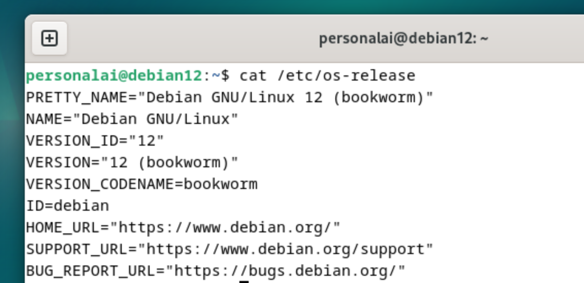
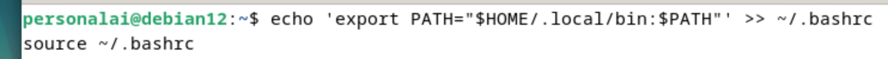
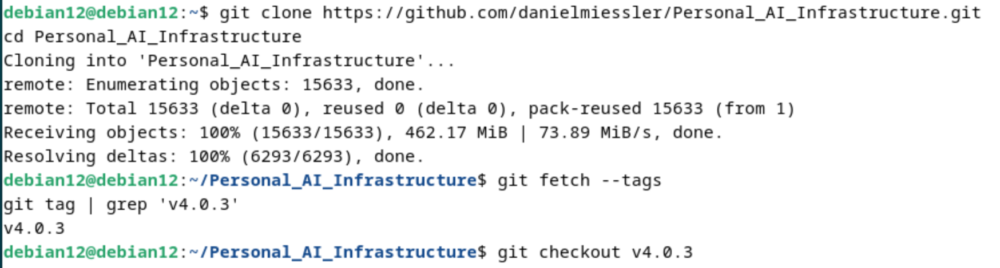
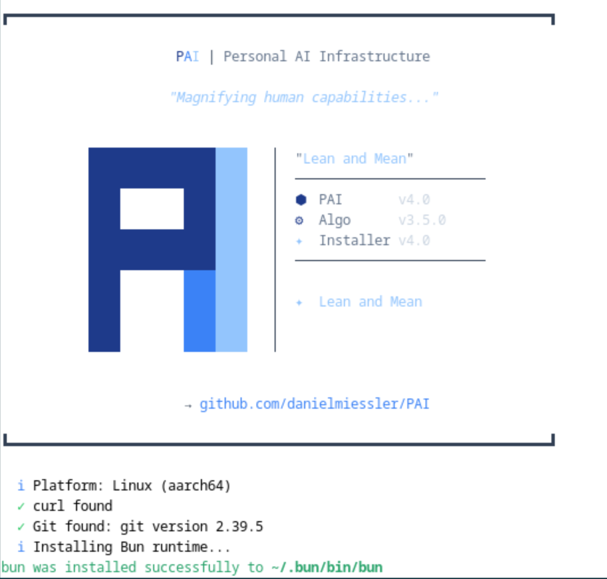
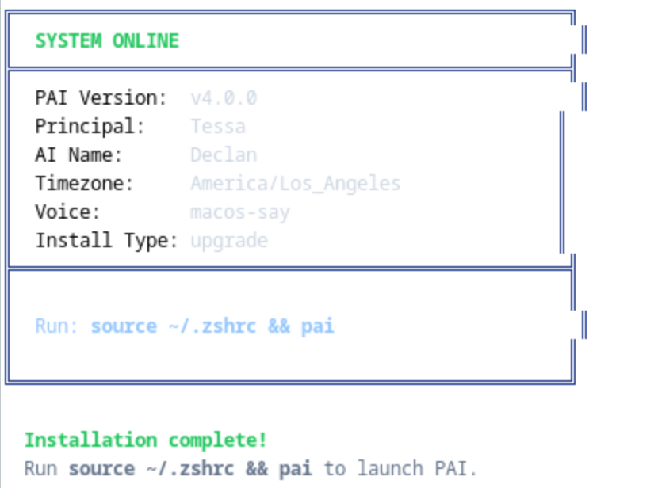
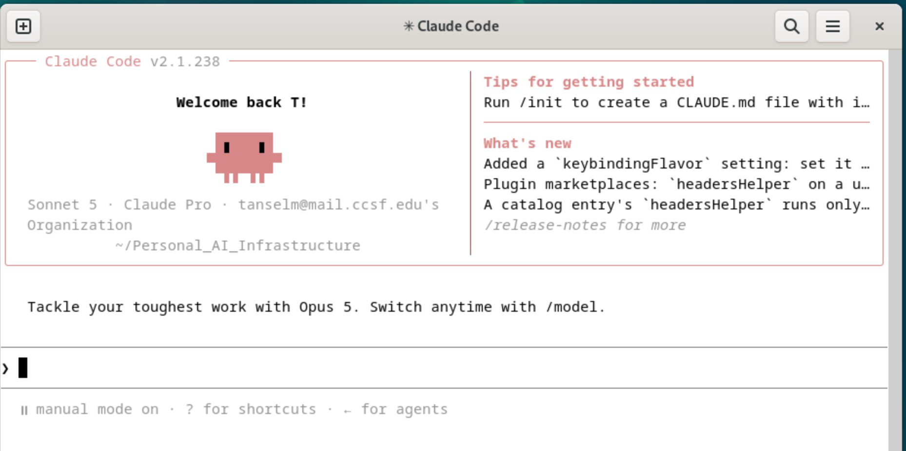
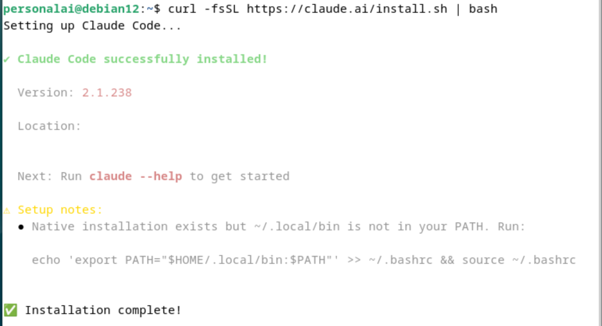
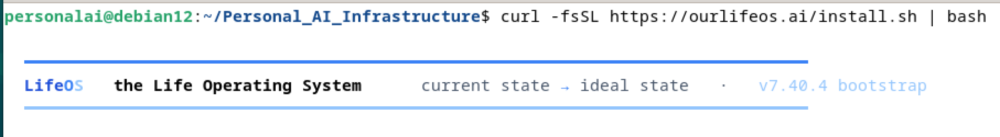

# Personal AI Infrastructure (PAI) and LifeOS on Debian

A practical walkthrough for running two generations of Daniel Miessler's personal AI framework on top of [Claude Code](https://claude.ai/code) inside a Debian VM.

The goal is to keep the older PAI release available for reference or coursework while running the current LifeOS release in a separate Linux user account. Keeping them isolated prevents their Claude configuration, tools, and dependencies from colliding.

## Overview

This setup uses two separate Linux users:

- **Admin user** — a sudo-enabled account used for the earlier PAI v4.0.3 environment.
- **`personalai`** — a regular, non-sudo account used for the current LifeOS v7.40.4 environment.

Each user has a separate home directory and its own `~/.claude` configuration.

## Environment



Both frameworks run inside a Debian VM rather than directly on the host machine. This creates a useful isolation boundary: the VM has its own filesystem, users, and software environment.

Access to host files, browser profiles, credentials, shared folders, clipboard data, or other host resources depends on what you explicitly expose through your VM configuration.

- **VM:** Debian GNU/Linux 12 (bookworm)
- **Agent runtime:** Claude Code CLI
- **Earlier framework:** PAI v4.0.3
- **Current framework:** LifeOS v7.40.4
- **Audio:** Not configured in this VM

---

# Setup 1: PAI v4.0.3

Use a sudo-enabled Linux account for the earlier PAI release.

## 1. Confirm your current user

```bash
whoami
```

Make sure you are logged into the account you want to use for the PAI v4.0.3 installation.

## 2. Install prerequisites

```bash
sudo apt update
sudo apt install curl git -y
```

If you are using VMware with a desktop environment:

```bash
sudo apt install open-vm-tools-desktop -y
sudo reboot
```

After the reboot, log back in.

## 3. Install Claude Code

```bash
curl -fsSL https://claude.ai/install.sh | bash
```

On Debian, Bash may not automatically include `~/.local/bin` in your `PATH`. If `claude` is not found, run:

```bash
echo 'export PATH="$HOME/.local/bin:$PATH"' >> ~/.bashrc
source ~/.bashrc
```



Verify the installation:

```bash
claude --version
```

## 4. Clone the PAI repository

```bash
cd ~
git clone https://github.com/danielmiessler/Personal_AI_Infrastructure.git
cd Personal_AI_Infrastructure
```



The current repository checkout may not contain the older `Releases/v4.0.3` directory. Fetch the historical tags and switch to the version used by this setup:

```bash
git fetch --tags
git checkout v4.0.3
```

Verify that the release files are present:

```bash
ls -la Releases/v4.0.3
```

You should see a `.claude` directory.

## 5. Install PAI v4.0.3

```bash
cd Releases/v4.0.3
cp -r .claude ~/
cd ~/.claude
bash install.sh
```



Follow the installer prompts.

### Voice/audio note

Voice features were skipped in this VM because no working audio device was passed through. They are not required for the rest of this walkthrough.

### Bash vs. zsh

The installer may tell you to run:

```text
source ~/.zshrc && pai
```

Debian commonly uses Bash instead of zsh. If `~/.zshrc` does not exist, use:

```bash
source ~/.bashrc
```



## 6. Verify the PAI launcher

Check whether the `pai` alias was created:

```bash
type pai
```

A working installation should return an alias that points to the PAI TypeScript launcher under your own home directory, for example:

```text
pai is aliased to `bun /home/<your-user>/.claude/PAI/Tools/pai.ts'
```

You can also inspect the alias in your Bash configuration:

```bash
grep "alias pai" ~/.bashrc
```

Then launch PAI:

```bash
pai
```



If `pai` launches successfully, the PAI v4.0.3 environment is ready.

---

# Setup 2: LifeOS v7.40.4

For the current release, use a separate Linux user so it does not share the older PAI user's `~/.claude` directory.

## 1. Create or switch to the LifeOS user

If the user does not already exist, create it from a sudo-enabled account:

```bash
sudo adduser personalai
```

For stronger separation, leave `personalai` as a regular non-sudo user unless LifeOS specifically needs administrative access for something you approve.

Switch to the user:

```bash
su - personalai
```

Verify:

```bash
whoami
echo $HOME
```

Expected:

```text
personalai
/home/personalai
```

The `-` in `su - personalai` loads that user's login environment, including its home directory and shell configuration.

## 2. Install Claude Code for `personalai`

Because each Linux user has a separate home directory, install Claude Code for this account too:

```bash
curl -fsSL https://claude.ai/install.sh | bash
```



If needed, add Claude to the Bash `PATH`:

```bash
echo 'export PATH="$HOME/.local/bin:$PATH"' >> ~/.bashrc
source ~/.bashrc
```

Verify:

```bash
claude --version
```

## 3. Install Bun

Check whether Bun is already installed:

```bash
bun --version
```

If it is missing:

```bash
curl -fsSL https://bun.sh/install | bash
source ~/.bashrc
```

Verify:

```bash
bun --version
```

In this setup, the installer detected Bun v1.4.0.

## 4. Install the current LifeOS release

Run:

```bash
curl -fsSL https://ourlifeos.ai/install.sh | bash
```



For this installation, LifeOS was placed under:

```text
/home/personalai/.claude/skills/LifeOS
```

The current LifeOS installation process is different from the older PAI v4.0.3 workflow. Do **not** use the old `cp -r .claude ~/` command for LifeOS v7.40.4.

## 5. Trust the workspace

Claude Code may display a workspace safety prompt:

```text
Quick safety check:
Is this a project you created or one you trust?

1. Yes, I trust this folder
2. No, exit
```

Only choose **Yes** for a project you intentionally downloaded or created and are comfortable allowing Claude Code to read, edit, and execute files within.

## 6. Complete LifeOS onboarding

The current setup is conversational rather than relying on the older PAI `install.sh` workflow.

LifeOS may guide you through:

- your current state and ideal state
- TELOS configuration
- sources or integrations you want to connect
- optional Claude Code hooks
- permissions required for additional functionality

Review each proposed change before approving it.

---

# Final Architecture

```text
Debian 12
│
├── root
│    └── system superuser
│
├── admin user
│    ├── sudo access
│    ├── Claude Code
│    ├── ~/.claude
│    └── PAI v4.0.3
│         └── pai
│
└── personalai
     ├── regular/non-sudo account
     ├── Claude Code
     ├── Bun
     ├── ~/.claude
     └── LifeOS v7.40.4
          └── ~/.claude/skills/LifeOS
```

The important Linux concept is that the two users have separate home directories:

```text
/home/<admin-user>
/home/personalai
```

That also means they have separate Claude configuration directories:

```text
/home/<admin-user>/.claude
/home/personalai/.claude
```

The older PAI `pai` alias belongs only to the shell configuration of the user where PAI was installed. It does not automatically become available to other Linux users.

This separation makes it easier to experiment with PAI v4 and LifeOS v7 without overwriting the same Claude configuration.

---

# VM Resource Notes

A small VM can become unstable while running a graphical Debian desktop, Claude Code, PAI/LifeOS, Git repositories, and development dependencies.

A more comfortable configuration for this setup is:

- **RAM:** about 8–9 GB
- **CPU:** 4 cores
- **Root storage:** about 70 GB
- **Swap:** 4 GB

Check your current resources with:

```bash
free -h
nproc
df -h /
sudo /sbin/swapon --show
```

If the root filesystem becomes nearly full, investigate before deleting system files:

```bash
sudo du -xhd1 / 2>/dev/null | sort -h
sudo du -xhd1 /var 2>/dev/null | sort -h
du -hd1 ~ 2>/dev/null | sort -h
```

APT's downloaded package cache can usually be cleared safely with:

```bash
sudo apt clean
```

---

# Privacy and Permissions

Before connecting personal data, email, credentials, or APIs, review the privacy and data-control settings for the AI services you use.

For Claude, review the current privacy controls in your Claude account settings and choose the data-sharing options that match your preferences.

Also treat API keys as secrets:

- do not commit them to GitHub
- avoid storing them directly in shell history
- use environment variables or a secrets-management approach where possible
- give agents only the permissions they actually need

---

# Example Use Case: Email Triage

One possible agentic workflow is automated email triage:

1. Connect an inbox or email API that the agent is authorized to access.
2. Provide context explaining which messages are important.
3. Define categories such as urgent, requires action, informational, or low priority.
4. Ask the agent to generate a daily summary.
5. Review the results and correct mistakes so the workflow can be refined.

This is a useful way to explore the difference between a simple chatbot and an **agentic system**: the model is not only answering a question, but using tools, context, rules, and multiple steps to complete an ongoing task.

For sensitive email, start with a test inbox or non-sensitive sample messages before giving an agent access to a primary mailbox.

---

# References

- [Daniel Miessler — Personal AI Infrastructure / LifeOS](https://github.com/danielmiessler/Personal_AI_Infrastructure)
- [Claude Code](https://claude.ai/code)
