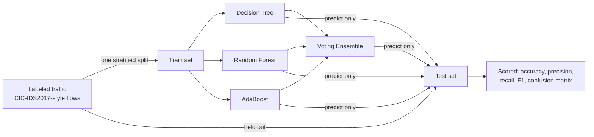

# ThreatVote AI

An interactive lab for cybersecurity threat detection using ensemble learning.
Four classifiers — Decision Tree, Random Forest, AdaBoost, and a Voting
Classifier combining all three — compete on the same labeled network-traffic
split, so you can see directly where ensembling helps and where it doesn't.



## Why this matters

Network intrusion detection is a binary classification problem with a nasty
property: the interesting class (attacks) is rare, and the cost of a miss
(false negative) is very different from the cost of a false alarm (false
positive). Ensemble methods — bagging (Random Forest) and boosting
(AdaBoost) — exist specifically to squeeze more signal out of weak learners
like a single decision tree. This project makes that tradeoff visible and
interactive: change the number of trees, the boosting iterations, or the
learning rate, and watch the confusion matrix move.

## Features

1. **Threat Detection Dashboard** — traffic composition by label, a confusion
   matrix for the best-performing model, and a sample of the labeled data.
2. **Model Battle** — all four models' accuracy, precision, recall, F1, and
   confusion matrices, side by side.
3. **Detection Failure Lab** — pick a model and see its actual false
   positives and false negatives, including which attack families it misses.
4. **Interactive Controls** — sidebar sliders for tree depth, number of
   trees, boosting iterations, learning rate, test-set size, and random seed.
5. **Model Evaluation** — accuracy, precision, recall, F1, and confusion
   matrices for every model, recomputed live as you change the controls.

## How this avoids data leakage

- **One split, done once, before any model is fit.** `data.split()` performs
  a single `train_test_split`; every model in the Model Battle trains on the
  exact same `X_train`/`y_train` and is scored only on `X_test`/`y_test`,
  which it never saw during `.fit()`.
- **No fitted preprocessing before the split.** Tree-based models need no
  scaling or encoding, so there is no scaler/encoder fit on the full dataset
  that could leak test-set statistics into training.
- **Identifier columns are dropped, not just unused.** Flow ID, source/destination
  IP, source port, and timestamp are removed before the split — a model that
  keeps these can memorize *which capture* a flow came from (and thus its
  label) instead of learning what attack traffic looks like.
- **Exact duplicate flows are dropped.** CIC-IDS2017 contains many duplicate
  rows; left in, the same row can land in both train and test, inflating the
  test score.
- **Stratified by attack family.** The split keeps class proportions (and,
  where possible, each individual attack family) balanced across train and
  test, so rare attack types still appear in both.
- **Attack family is never a feature.** The granular label (e.g. `"DoS Hulk"`)
  is only used to annotate predictions in the Detection Failure Lab, never
  passed to `.fit()`.

## Project layout

```
threatvote-ai/
├── app.py            Streamlit app (3 tabs)
├── data.py           Dataset generation, cleaning, leakage-safe split
├── models.py         Model construction, training, evaluation
├── requirements.txt
├── data/
│   ├── sample/       Bundled synthetic sample (committed, small)
│   └── raw/          Real CIC-IDS2017 CSVs go here (gitignored, not committed)
└── tests/
    ├── test_data.py
    └── test_models.py
```

## Dataset

### Bundled sample (default, works out of the box)

`data/sample/cicids2017_sample.csv` is a small (4,000-row), synthetically
generated dataset that mimics the column names and six most common classes
of the real CIC-IDS2017 "GeneratedLabelledFlows" CSVs (`BENIGN`, `DoS Hulk`,
`DDoS`, `PortScan`, `Bot`, `Web Attack - Brute Force`). It's generated with a
fixed random seed (`data.py`'s `generate_sample`), so it's fully reproducible
and requires no download. Regenerate it any time with:

```bash
python data.py
```

This sample is for development and demoing the app's mechanics — it is not a
substitute for the real dataset when evaluating actual detection accuracy.

### Real CIC-IDS2017 (optional, for realistic results)

1. Download the CSV flow files ("GeneratedLabelledFlows", ~230 MB zipped)
   from the Canadian Institute for Cybersecurity:
   https://www.unb.ca/cic/datasets/ids-2017.html
2. Unzip, and copy one or more of the per-day CSVs (e.g.
   `Friday-WorkingHours-Afternoon-DDos.pcap_ISCX.csv`) into `data/raw/` in
   this project.
3. **Do not commit these files.** `data/raw/` is already in `.gitignore`;
   the full dataset is multiple gigabytes and is not meant to live in this
   (or any) Git repository.
4. Launch the app — any CSV found in `data/raw/` appears as a selectable
   data source in the sidebar. Real files are capped to a configurable
   number of rows (sidebar slider) before training, since the raw CSVs can
   have millions of rows.

## Setup

```bash
cd threatvote-ai
python3 -m venv .venv
source .venv/bin/activate        # Windows: .venv\Scripts\activate
pip install -r requirements.txt
```

## Running the app

```bash
streamlit run app.py
```

This opens the dashboard at `http://localhost:8501`. Use the sidebar to pick
a data source, adjust the train/test split, and tune each model's
hyperparameters — all three tabs recompute live.

## Running the tests

```bash
pytest
```

Tests cover: reproducibility of the synthetic sample, cleaning (identifier
columns dropped, duplicates removed, no `inf`/`NaN` survives), that the
train/test split has no overlapping rows and every attack family appears in
both splits, that the attack-family label is never used as a feature, and
that each model's metrics land in `[0, 1]` and respond to their
hyperparameters.

## Status

Minimum viable product. All five requested features are implemented end to
end against the bundled sample dataset and work against real CIC-IDS2017
CSVs dropped into `data/raw/`. Possible next steps: additional engineered
features from raw CIC-IDS2017 columns, SHAP-based feature-importance views,
and saving/loading trained models.
